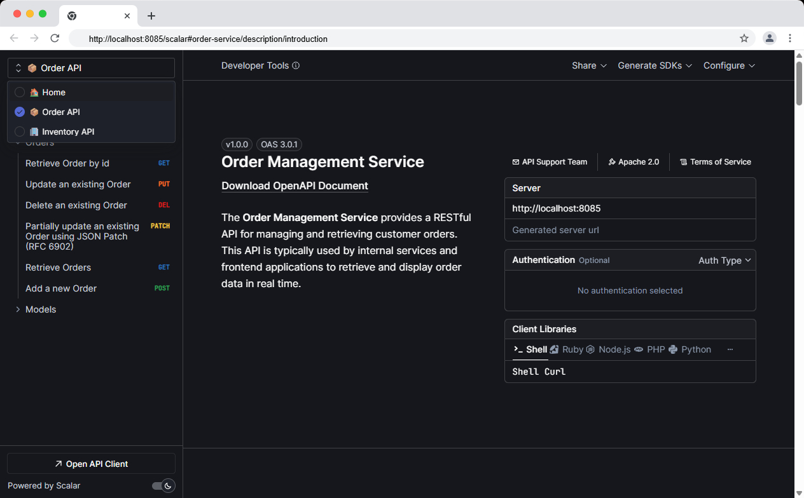
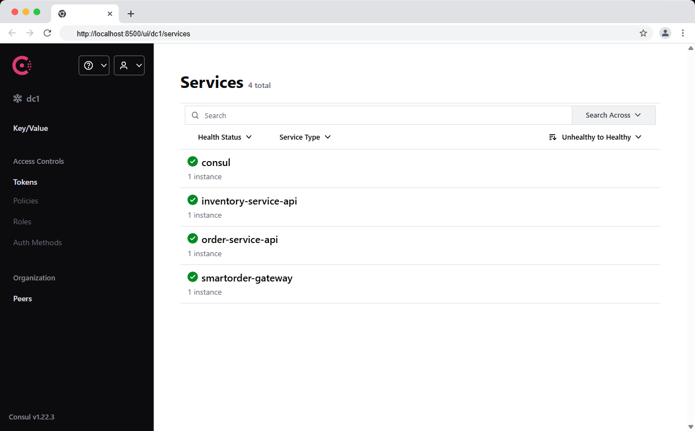
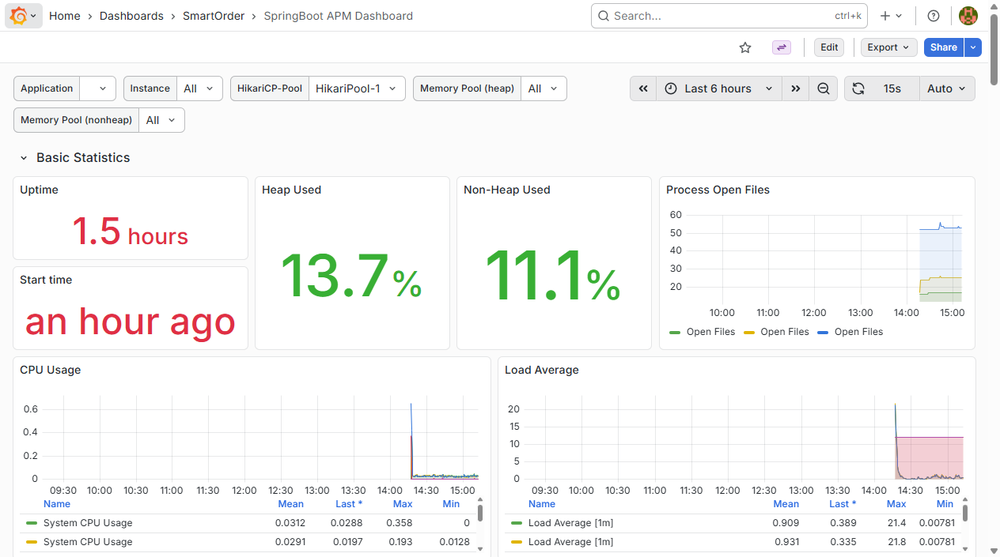
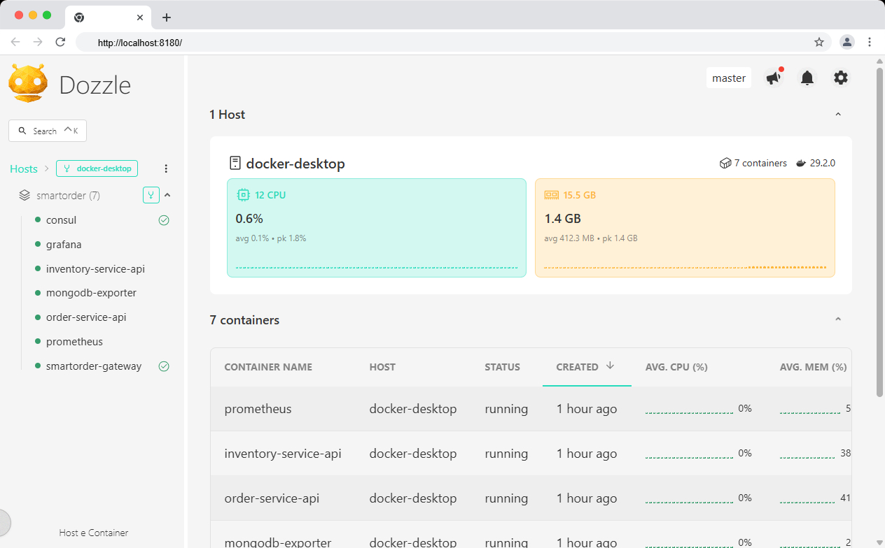
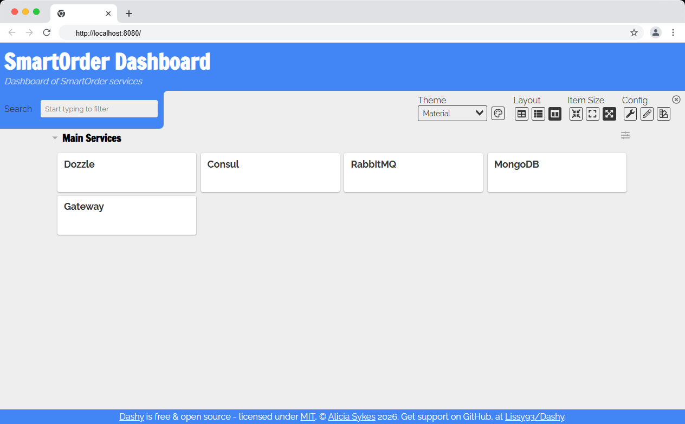

[](https://github.com/portus84/smartorder-ms/actions/workflows/maven.yml)
[](https://github.com/portus84/smartorder-ms/actions/workflows/ci-docker.yml)
[](https://github.com/portus84/smartorder-ms/actions/workflows/sonarcloud.yml)

# SmartOrder Microservices Platform

SmartOrder is a **microservices-based reference platform** built with **Spring Boot and Spring Cloud**, designed to
demonstrate a **production-ready architecture** including service discovery, API Gateway, messaging, observability,
monitoring, and local development tooling via Docker Compose.

The project emphasizes **clean architecture**, **event-driven communication**, **cloud-native patterns**, and *
*developer experience**.

---

## 📖 Articles & Deep Dive

SmartOrder is explained in detail in the following articles:

### Dev.to Series

- [SmartOrder – A Modern Microservices Reference Platform](https://dev.to/portus84/smartorder-a-modern-microservices-reference-platform-ng8)

### Medium Publication

- [SmartOrder – A Modern Microservices Reference Platform](https://medium.com/@francesco.portus/list/smartorder-a-modern-microservices-reference-platform-fb04ed900a1a)

These articles provide a complete architectural walkthrough of the platform, from high-level design to service
implementation details.

---

## 🎯 Project Goals

- Provide a realistic microservices reference architecture
- Enable one-command local startup
- Showcase cloud-native and observability-first design
- Serve as a learning and experimentation platform

---

## 🧱 Architecture Overview

The platform is composed of:

- **Spring Cloud Gateway** as the API Gateway
- **Multiple Spring Boot microservices**
- **RabbitMQ** for asynchronous messaging
- **Consul** for service discovery and configuration
- **MongoDB** as the primary datastore
- **Docker & Docker Compose** for local orchestration
- **Full observability stack** (Prometheus, Grafana, InfluxDB, Dozzle, etc.)

The system follows **Domain-Driven Design (DDD)** and **REST + HATEOAS** principles.

---

## 📦 Microservices

### Gateway

- **Spring Cloud Gateway**
- Dynamic routing via Consul
- Circuit breaker fallback endpoints
- CORS configuration
- Central entry point for all APIs

### Business Services

Each service is:

- A standalone **Spring Boot application**
- Registered to **Consul**
- Exposing REST APIs with **Spring HATEOAS**
- Instrumented with **Micrometer**

Services include:

- Order Service
- Inventory Service
- Product Service
- (others depending on branch evolution)

The **Gateway** service uses [Scalar](https://scalar.com/) for its API documentation UI, as shown below:




---

## 🔄 Communication

### Synchronous

- REST over HTTP
- Gateway → Services
- HATEOAS-enabled responses

### Asynchronous

- **RabbitMQ**
- Event-based messaging
- Decoupled service interactions
- Prepared for CQRS / eventual consistency patterns

> Kafka is intentionally **not used** in this project. RabbitMQ was chosen for simplicity, local development, and
> classic messaging semantics.

---

## 🧠 Service Discovery & Configuration

### Consul

- Service registration
- Health checks
- Configuration management
- Centralized discovery for Gateway routing

All services auto-register themselves to Consul at startup.

**Consul** home page:



---

## 🗄️ Data Layer

### MongoDB

- Used by business services
- Dockerized
- Schema-less persistence
- Indexing configured per service responsibility

---

## 📊 Observability & Monitoring

The project includes a **complete observability stack**, fully dockerized.

### Prometheus

- Metrics scraping via Micrometer
- JVM metrics
- HTTP metrics
- Custom application metrics

### Grafana

- Pre-provisioned dashboards:
    - JVM Micrometer Dashboard
    - MongoDB Dashboard
    - JMeter Load Testing Dashboard
- Auto-loaded dashboards via provisioning
- Ready-to-use visualization layer

**Grafana** home page:



### InfluxDB

- Time Series Database (TSDB) for storing high-frequency data like metrics, events, and logs.
- Query languages: InfluxQL (SQL-like) and Flux for advanced analytics.
- Use cases & advantages: Fast read/write, time-based aggregations, retention policies, integrates easily with Grafana
  and monitoring tools.

### Dozzle

- Real-time Docker log viewer
- Centralized log streaming
- Useful for local debugging

**Dozzle** home page:



### Dashy

- Unified developer dashboard
- Entry point to all tools (Grafana, Prometheus, Consul, InfluxDB, etc.)

**Dashy** home page:



---

## 📦 Build, Test & Code Coverage (Maven)

This project uses **Maven** as the build system. The following instructions assume you have:

- **Java JDK installed** (version required by the project, minimum jdk version is 21)
- **Maven installed** or use the provided Maven Wrapper (`mvnw` / `mvnw.cmd`)
- Your `JAVA_HOME` and `PATH` configured appropriately

### ✅ 1. Build the Project

To compile the application and package all modules:

```bash
# Using installed Maven
mvn clean install
# Or using the Maven wrapper
./mvnw clean install
```

The above command will:

- Download dependencies
- Compile source code
- Run tests
- Build artifacts (JARs, modules, etc.)

If you want to skip tests during build:

```bash
mvn clean install -DskipTests
./mvnw clean install -DskipTests
```

### 🧪 2. Run Tests

To run all tests:

```bash
mvn test
# Or with the Maven wrapper
./mvnw test
```

Test reports are generated under:

```text
target/surefire-reports/
```

### 📊 3. Generate JaCoCo Code Coverage Report

To generate the JaCoCo coverage report:

```bash
mvn clean test jacoco:report
```

Or as part of the full build:

```bash
mvn clean install jacoco:report
```

This will:

- Execute tests with the JaCoCo agent enabled
- Produce coverage data
- Generate an HTML coverage report

#### 📁 Coverage Report Location

After execution, the report will be available at:

```text
target/site/jacoco/index.html
```

Open this file in your browser to view detailed coverage metrics.

### Additional Commands

Run the full verification lifecycle:

```bash
mvn verify
./mvnw verify
```

Skip both tests and coverage:

```bash
mvn clean install -DskipTests -Djacoco.skip=true
```

---

## 🌱 Spring Profiles Strategy

SmartOrder uses **Spring profiles** to separate the Docker-based production-like environment from the local development
setup.

| Profile              | Purpose                     | Typical Usage                               |
|----------------------|-----------------------------|---------------------------------------------|
| default (no profile) | Production-like environment | Running the platform with Docker Compose    |
| `dev`                | Local development           | Running microservices directly from the IDE |

### Details

**Default profile (no active profile)**

- Used when running the platform via **Docker Compose**
- Simulates a **production-like environment**
- Infrastructure services (Consul, MongoDB, RabbitMQ, monitoring stack) are provided by Docker

**`dev` profile**

- Intended for **local development**
- Allows running microservices **directly from the IDE**
- Useful when developing or debugging individual services

> ⚠️ **IMPORTANT:** When building and running the platform with Docker, **do not activate any Spring profile**.

---

## 🐳 Docker & Local Development

The `docker/` directory is **highly structured** and represents a key strength of this repository.

### Dockerized Components

- Gateway
- All microservices
- RabbitMQ
- MongoDB
- Consul
- Prometheus
- Grafana
- InfluxDB
- Dozzle
- Dashy

### Docker Compose

- Multi-compose setup
- Config services separated from business services
- Reproducible local environment
- Zero external dependencies required

### 🐳 Docker Structure

The Docker setup is a core part of the project, not an afterthought.

```
docker
├── config-services
│   ├── dashy
│   ├── grafana
│   ├── influxdb
│   ├── jmeter
│   ├── prometheus
├── docker-compose.all.yml
├── docker-compose.monitoring.yml
├── docker-compose.persistence.yml
```

The `docker-compose.all.yml` file orchestrates **the entire ecosystem.**

## 🚀 How to Run the Platform

### Prerequisites

- Docker
- Docker Compose (v2)

### Start the entire platform

> **⚠️ IMPORTANT**: Build the platform **without enabling any Spring profiles**.
> The Docker environment will simulate a **production-like setup**.   
> The `dev` profile is intended **exclusively for running the microservices locally during development**.

The **whole SmartOrder platform** (infrastructure + services + observability) can be started using:

```bash
docker compose -f docker-compose.all.yml up -d --build --force-recreate
```

## 👤 Author

Francesco Portus
Software Architect / Solution Architect
